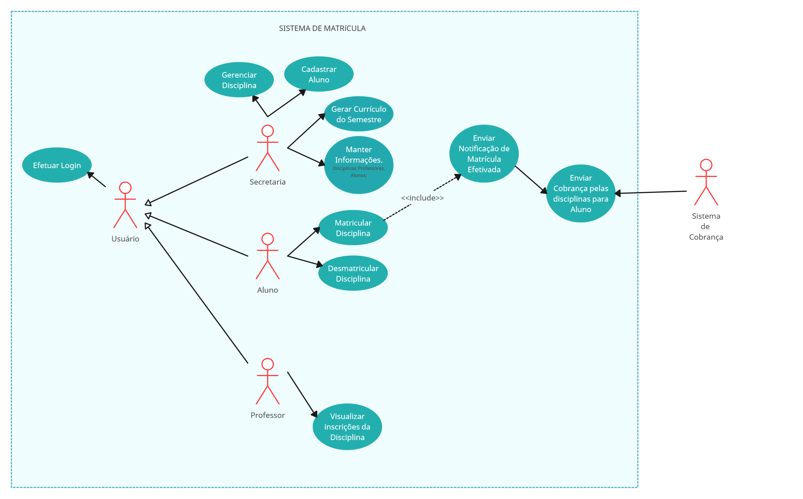

# Documentação do Projeto

## Caso de uso

## Histórias de Usuários

Eu, como uma estudante, quero me matricular em disciplinas para o próximo semestre, para que eu possa cumprir a carga de horas do curso.

Eu, como um estudante, quero ver quais disciplinas estão disponíveis para o próximo semestre, para que eu possa escolher as disciplinas que eu quero me matricular.

Eu, como um estudante, quero ver quais disciplinas eu já me matriculei, para que eu possa me planejar para o próximo semestre.

Eu, como um estudante, quero conseguir desmatricular disciplinas, para que eu possa remediar erros de matrícula.

Eu, como um estudante, quero conseguir efetuar login no sistema, para que eu possa me matricular.

Eu, como um professor, quero ver quais disciplinas eu estou ministrando, para que eu possa me preparar para o próximo semestre.

Eu, como um professor, quero ver quais alunos estão matriculados em minha disciplina, para que eu possa ver quem está matriculado.

Eu, como um professor, quero conseguir efetuar login no sistema, para que eu possa ver quais alunos estão matriculados em minha disciplina e quais disciplinas estou associado.

Eu, como uma secretaria, quero cadastrar alunos, para que eles possam se matricular em disciplinas.

Eu, como uma secretaria, quero gerar currículo do semestre, para que as disciplinas efetivadas sejam registradas e organizadas.

Eu, como uma secretaria, quero gerar relatório de matrículas, para que eu possa ver quais alunos estão matriculados em quais disciplinas.

Eu, como uma secretaria, quero manter informações de status da disciplina, para que as suas informações estejam atualizadas.

Eu, como uma secretaria, quero manter informações de matricula de aluno, para que as suas informações estejam atualizadas.

Eu, como uma secretaria, quero manter informações das disciplinas atribuidas ao professor, para que as suas informações estejam atualizadas.
